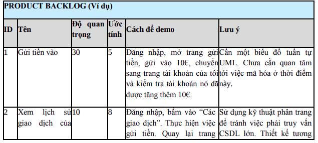

# Scrum Cơ Bản

## 2. Chúng tôi làm Product Backlog như thế nào
* Product Backlog là trái tim của Scrum, về cơ Product Backlog là một danh sách các ưu cầu, các story, hoặc các tính năng của sản phẩm. Đó là các thứ mà khách hàng mong muốn và được mô tả bằng thuật ngữ của khách hàng
* Nhưng story đó bao gồm các trường sau:
  * ID-một định danh duy nhất, là một số tự tăng
  * Name-một cái tên ngắn gọn, mô tả cho story
  * Importance(Độ quan trọng)- Mức độ quan trong của story mà Product Owner đánh giá.
  * Initial estimate(Ước lượng ban đầu)-một ước tính ban đầu của đội dự án về khối lượng làm việc cần thiết để thực hiện story(story point) và nó tương ứng với "ý tưởng ngày công"
  * How to demo (Cách để demo)-một bản mô tả ở mức độ cao về cách demo tính năng này trong buổi demo cuối Sprint. Về cơ bản thường là một đặc tả kiểm thử đơn giản. "Làm thế này, sau đó làm thế này, thì cái này sẽ xảy ra"
  * Notes
* Các trường khác
  * Track(Nhánh)-Phân loại story
  * Components-Story này thuộc về thành phần nào: Server, Client, Database
  * Requestor
  * Bug tracking ID

## 3. Chúng tôi chuẩn bị họp kế hoạch Sprint như thể nào
* Hãy nhớ chắc chắn Product Backlog đã định hình trước khi tiến hành họp kế hoạch Sprint
* Nếu các thứ trong Product Backlog chưa được hoàn thành sẽ không có cuộc họp kế hoạch Sprint như thế nào
* Product Owner phải là người hiểu rõ từng story
* Những nguời không phải Product Owner có thể bổ sung story vào Product Backlog. Nhưng họ không được gán importance cho story đó, Product Owner sẽ là người làm việc đó và việc estimate thuộc về development

## 4. Chúng tôi họp kế hoạch Sprint ra sao
*  Kết quả của buổi lập kế  hoạch Sprint:
  * Xác định mục tiêu của Sprint
  * Danh sách thành viên của nhóm
  * Sprint Backlog
  * Xác định được ngày demo Sprint (Sơ kết Sprint)
  * Xác định thời gian và địa điểm cho buổi họp Scrum hằng ngày
* Product Owner bắt buộc phải có mặt, nếu không có mặt thì có các phương pháp sau
  * Hỏi xem bao giờ họ có thời gian
  * Nếu không tham gia yêu cầu ủy quyền cho ai đó
  * Nếu vẫn không tham gia thì team sẽ làm theo những gì mà team cho là quan trọng nhất

### Tại sao chất lượng là thứ không thể thỏa hiệp

## 9. Chúng tôi Sơ kết Sprint ra sao ?
* Trong buổi sơ kết Sprint thì chỉ nển tập trung vào demo những thứ mà chúng ta đã làm được hơn là trình bày cách mà chúng ta đã làm

## 10. Chúng tôi cải tiến Sprint như thế nào
* Các yếu tố cần cải tiến trong Sprint
  * Tốt: nếu chúng tôi có thể làm lại một Sprint tưonwg tự như vậy, chúng tôi có thể  làm những công việc tương tự theo cách này
  * Có thể làm tốt hơn: chúng ta có thể làm tốt hơn được nữa không
  * Cải tiến: ý tưởng gì để cải tiến trong tương lai không
* Phải cần khoảng nghỉ giữa 2 Sprint
  * Cách tố nhất là: Thứ 6 họp kết thúc Sprint, Thứ 2 tuần sau họp bắt đầu Sprint mới (Để cho mọi người có khoảng thời gian nghỉ ngơi)
* Trong mỗi Sprint sẽ cố gắng có một ngày gọi là lab days (ngày mà bạn có thể làm bất kể những gì bạn muốn)
  * Nếu bạn muốn có ngày lab days, lịch tốt nhất sẽ là: Thứ 5 tổng kết Sprint, Thứ 6 lab days, Thứ 2 ngày bắt đầu Sprint mới (Mỗi Sprint thì chỉ có 8 ngày dev, nên cần cân nhắc mực độ của Sprint để team có thể đạt được quy trình làm việc)

## 12. Chúng tôi lập kế hoạch phát hành và định giá các hợp đồng như thế nào
* Lập kế hoạch phát hành giúp chúng ta cố  gắng trả lời câu hỏi "khi nào, hoặc muộn nhất, chúng ta sẽ có thể chuyển giao được phiên bản 1.0 của hệ thống mới này"
* Các cuộc họp phải tuân thủ khung thời gian
* Khi bắt đầu Sprint mới thì sẽ dùng một khoảng thời gian để có thể vừa fix bug của Spint trước mà vừa có thể làm Sprint mới
* Tập trung hoàn thành các tính năng của một Sprint, sau đó mới chuyển sang một Sprint mới

## 15. Chúng tôi quản lý nhiều nhóm Scrum như thế nào
* Tùy thuộc vào việc tương tác giữa mọi người với nhau trong nhóm Scrum mà có tách nhóm hay không.
* Kích thước nhóm từ 3-8 người (5-9) tùy vào từng project cụ thể mà ta sẽ có cái đánh giá và cải thiện hợp lý
* Cần thận khi đưa một thành viên part time vào nhóm Scrum
